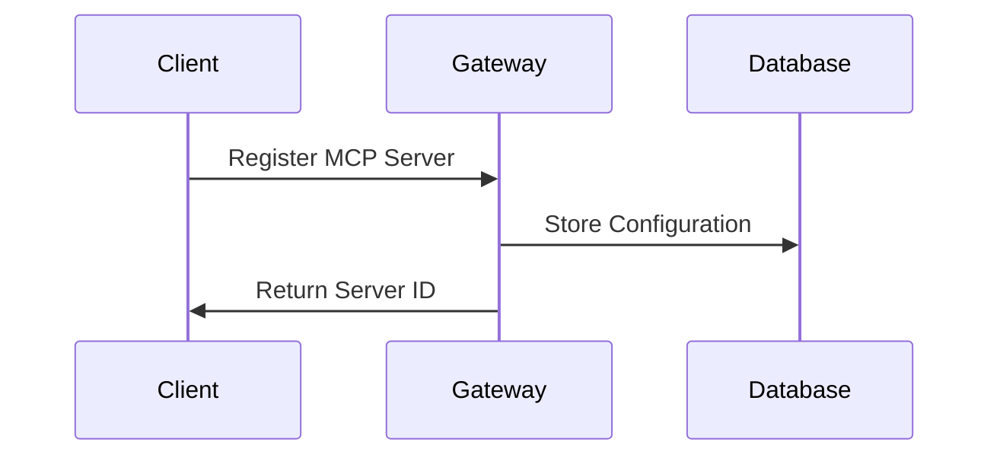
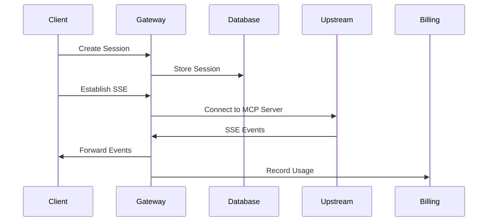
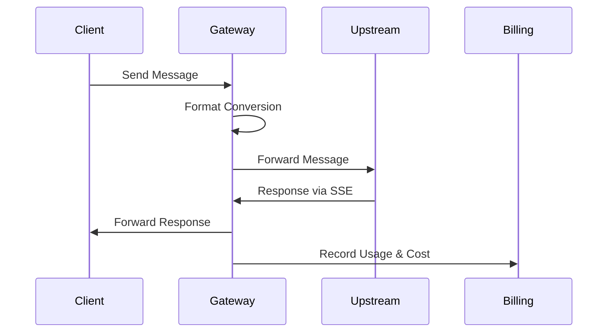

# MCP Gateway Architecture

## Overview

The MCP Gateway is a comprehensive Spring Boot application that provides secure, scalable API management with session-based transport management and pay-for-usage billing. It acts as a proxy between clients and upstream MCP servers, offering real-time communication and usage tracking.

## System Architecture

```
┌─────────────────┐    ┌─────────────────┐    ┌─────────────────┐
│    Client       │    │   MCP Gateway   │    │  Upstream MCP   │
│  Applications   │◄──►│                 │◄──►│    Servers      │
└─────────────────┘    │  ┌───────────┐  │    └─────────────────┘
                       │  │Controllers│  │
                       │  └─────┬─────┘  │
                       │        │        │
                       │  ┌─────┴─────┐  │
                       │  │ Services  │  │
                       │  └─────┬─────┘  │
                       │        │        │
                       │  ┌─────┴─────┐  │
                       │  │Repositories│  │
                       │  └─────┬─────┘  │
                       │        │        │
                       └────────┴────────┘
                                │
                           ┌────┴────┐
                           │   H2    │
                           │Database │
                           └─────────┘
```

## Core Components

### 1. Controllers Layer
- **AuthController**: JWT authentication and user management
- **McpServerController**: MCP server registration and configuration
- **SessionController**: Session creation and management
- **SessionTransportController**: Transport protocol handling (SSE, WebSocket, HTTP)
- **BillingController**: Usage tracking and billing analytics

### 2. Service Layer
- **SessionService**: Session lifecycle management and coordination
- **McpServerConnectionService**: Upstream connection management and message forwarding
- **UsageBillingService**: Real-time usage tracking and cost calculation
- **UserService**: User authentication and authorization
- **WebClientConfig**: HTTP client configuration for upstream requests

### 3. Repository Layer
- **UserRepository**: User data access
- **McpServerRepository**: MCP server configuration storage
- **SessionRepository**: Session state management
- **UsageRecordRepository**: Billing and usage data
- **BillingRuleRepository**: Pricing rules and configuration

### 4. Domain Model
- **User**: User authentication and profile
- **McpServer**: MCP server configuration and endpoints
- **Session**: Session state and transport configuration
- **UsageRecord**: API usage tracking for billing
- **BillingRule**: Flexible pricing rules and patterns

## Transport Architecture

### SSE (Server-Sent Events) Proxy
```
Client ←→ MCP Gateway ←→ Upstream MCP Server
   │         │                    │
   │    ┌────┴────┐               │
   │    │ Session │               │
   │    │ Service │               │
   │    └────┬────┘               │
   │         │                    │
   │    ┌────┴────┐               │
   │    │Connection│              │
   │    │ Service │◄──────────────┘
   │    └─────────┘
   │
   └──► Billing Service
```

### Supported Transport Types

1. **SSE (Server-Sent Events)**
   - Real-time bidirectional streaming
   - Automatic upstream connection establishment
   - Message format adaptation (JSON-RPC ↔ Standard)
   - Connection lifecycle management

2. **WebSocket** (Framework Ready)
   - Full-duplex real-time communication
   - Persistent connection management
   - Message routing and forwarding

3. **Streamable HTTP** (Framework Ready)
   - Streaming HTTP responses
   - Large data transfer optimization
   - Progressive response handling

4. **STDIO** (Framework Ready)
   - Standard input/output integration
   - Command-line tool compatibility
   - Process-based communication

## Security Architecture

### Authentication Flow
```
1. Client → POST /auth/authenticate
2. Gateway → Validate credentials
3. Gateway → Generate JWT token
4. Gateway → Return token + userId
5. Client → Include token in subsequent requests
6. Gateway → Validate token for each request
```

### Session Security
- JWT-based authentication for all endpoints
- Session-specific access control
- Automatic session expiration
- Secure token management

## Billing System Architecture

### Usage Tracking Flow
```
1. API Request → SessionService
2. SessionService → Record usage start
3. Process Request → Upstream/Local
4. Response Generated → Calculate metrics
5. UsageBillingService → Apply billing rules
6. UsageRecord → Store in database
7. Real-time cost calculation
```

### Billing Components
- **UsageRecord**: Detailed usage tracking
- **BillingRule**: Flexible pricing patterns
- **Cost Calculation**: Real-time fee computation
- **Analytics**: Usage statistics and reporting

## Data Flow

### 1. MCP Server Registration


### 2. Session Creation & SSE Connection


### 3. Message Forwarding


## Configuration Management

### Environment Configuration
```yaml
server:
  port: 8080

spring:
  datasource:
    url: jdbc:h2:mem:mcpdb
    driver-class-name: org.h2.Driver

jwt:
  secret: your-secret-key
  expiration: 86400000

mcp:
  session:
    expiration: 3600
```

### MCP Server Configuration
- Transport type and endpoints
- Authentication methods (API Key, Basic Auth, OAuth2)
- Session ID handling (Query, Header, Path)
- Connection timeouts and retries

## Error Handling & Monitoring

### Error Handling Strategy
- Global exception handling
- Transport-specific error responses
- Upstream connection error management
- Client-friendly error messages

### Monitoring & Logging
- Real-time usage tracking
- Connection lifecycle logging
- Performance metrics collection
- Billing accuracy monitoring

## Scalability Considerations

### Current Architecture
- Single-instance deployment
- In-memory H2 database
- Synchronous request processing
- Local session storage

### Future Scalability
- Horizontal scaling with load balancers
- External database (PostgreSQL/MySQL)
- Distributed session management
- Async message processing
- Microservices decomposition

## Performance Optimization

### Connection Management
- Connection pooling for upstream servers
- Automatic connection cleanup
- Timeout management
- Resource optimization

### Billing Performance
- Asynchronous usage recording
- Batch processing for analytics
- Indexed database queries
- Efficient cost calculations

## Security Considerations

### Data Protection
- JWT token security
- Sensitive data masking in logs
- Secure upstream communication
- Input validation and sanitization

### Access Control
- Role-based authentication
- Session-based authorization
- API rate limiting
- Request validation

---

**Architecture Version**: 2.0.0  
**Last Updated**: 2024-01-15 