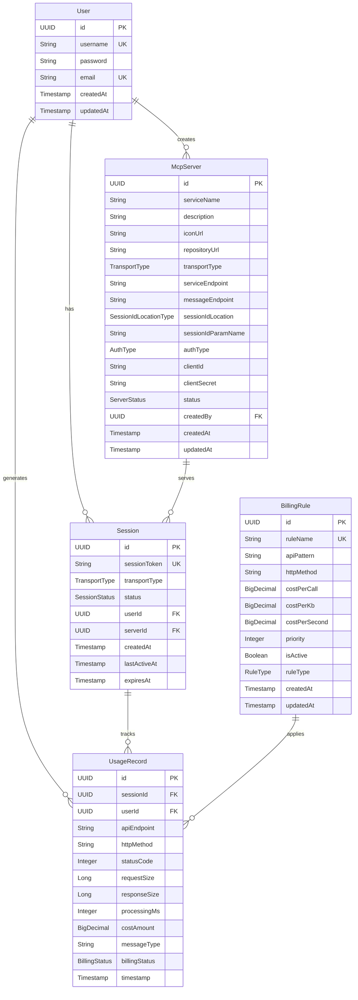

# MCP Gateway Data Model

## Overview

The MCP Gateway uses H2 database (in-memory for development) to store user authentication, MCP server configurations, session management, and billing data. This document describes the current data model and relationships.

## Entity Relationship Diagram



## Core Entities

### 1. User

User authentication and profile management.

```sql
CREATE TABLE users (
    id UUID PRIMARY KEY,
    username VARCHAR(255) NOT NULL UNIQUE,
    password VARCHAR(255) NOT NULL,
    email VARCHAR(255) NOT NULL UNIQUE,
    created_at TIMESTAMP NOT NULL DEFAULT CURRENT_TIMESTAMP,
    updated_at TIMESTAMP NOT NULL DEFAULT CURRENT_TIMESTAMP
);
```

**Key Features:**
- Unique username and email constraints
- Encrypted password storage
- Automatic timestamp management

### 2. McpServer

MCP server configuration and connection details.

```sql
CREATE TABLE mcp_servers (
    id UUID PRIMARY KEY,
    service_name VARCHAR(255) NOT NULL,
    description TEXT,
    icon_url VARCHAR(500),
    repository_url VARCHAR(500),
    transport_type VARCHAR(50) NOT NULL,
    service_endpoint VARCHAR(500) NOT NULL,
    message_endpoint VARCHAR(500),
    session_id_location VARCHAR(50),
    session_id_param_name VARCHAR(100),
    auth_type VARCHAR(50),
    client_id VARCHAR(255),
    client_secret VARCHAR(255),
    status VARCHAR(50) NOT NULL DEFAULT 'REGISTERED',
    created_by UUID NOT NULL,
    created_at TIMESTAMP NOT NULL DEFAULT CURRENT_TIMESTAMP,
    updated_at TIMESTAMP NOT NULL DEFAULT CURRENT_TIMESTAMP,
    FOREIGN KEY (created_by) REFERENCES users(id)
);
```

**Key Features:**
- Flexible transport configuration
- Multiple authentication methods
- Connection endpoint management
- Status tracking

### 3. Session

Session management for different transport types.

```sql
CREATE TABLE sessions (
    id UUID PRIMARY KEY,
    session_token VARCHAR(255) NOT NULL UNIQUE,
    transport_type VARCHAR(50) NOT NULL,
    status VARCHAR(50) NOT NULL DEFAULT 'CREATED',
    user_id UUID NOT NULL,
    server_id UUID NOT NULL,
    created_at TIMESTAMP NOT NULL DEFAULT CURRENT_TIMESTAMP,
    last_active_at TIMESTAMP NOT NULL DEFAULT CURRENT_TIMESTAMP,
    expires_at TIMESTAMP NOT NULL,
    FOREIGN KEY (user_id) REFERENCES users(id),
    FOREIGN KEY (server_id) REFERENCES mcp_servers(id)
);
```

**Key Features:**
- Unique session tokens
- Transport type tracking
- Automatic expiration
- Activity monitoring

### 4. UsageRecord

Detailed usage tracking for billing purposes.

```sql
CREATE TABLE usage_records (
    id UUID PRIMARY KEY,
    session_id UUID NOT NULL,
    user_id UUID NOT NULL,
    timestamp TIMESTAMP NOT NULL DEFAULT CURRENT_TIMESTAMP,
    api_endpoint VARCHAR(255) NOT NULL,
    http_method VARCHAR(10),
    status_code INTEGER NOT NULL,
    request_size BIGINT,
    response_size BIGINT,
    processing_ms INTEGER,
    cost_amount DECIMAL(10,4),
    message_type VARCHAR(50),
    error_message VARCHAR(500),
    client_ip VARCHAR(45),
    user_agent VARCHAR(255),
    billing_status VARCHAR(20) DEFAULT 'SUCCESS',
    FOREIGN KEY (session_id) REFERENCES sessions(id),
    FOREIGN KEY (user_id) REFERENCES users(id)
);
```

**Key Features:**
- Comprehensive usage metrics
- Cost calculation storage
- Error tracking
- Performance monitoring

### 5. BillingRule

Flexible pricing rules and patterns.

```sql
CREATE TABLE billing_rules (
    id UUID PRIMARY KEY,
    rule_name VARCHAR(100) NOT NULL UNIQUE,
    api_pattern VARCHAR(255) NOT NULL,
    http_method VARCHAR(10),
    cost_per_call DECIMAL(10,4) NOT NULL DEFAULT 0,
    cost_per_kb DECIMAL(10,6),
    cost_per_second DECIMAL(10,6),
    is_active BOOLEAN NOT NULL DEFAULT true,
    priority INTEGER NOT NULL DEFAULT 0,
    description VARCHAR(500),
    rule_type VARCHAR(20) NOT NULL DEFAULT 'SIMPLE',
    bill_failed_calls BOOLEAN DEFAULT false,
    minimum_cost DECIMAL(10,4),
    maximum_cost DECIMAL(10,4),
    created_at TIMESTAMP NOT NULL DEFAULT CURRENT_TIMESTAMP,
    updated_at TIMESTAMP NOT NULL DEFAULT CURRENT_TIMESTAMP
);
```

**Key Features:**
- Pattern-based API matching
- Multiple pricing models
- Priority-based rule selection
- Flexible cost calculation

## Enums and Constants

### TransportType
```java
public enum TransportType {
    SSE,
    WEBSOCKET,
    STREAMABLE_HTTP,
    STDIO
}
```

### SessionIdLocationType
```java
public enum SessionIdLocationType {
    QUERY_PARAM,
    HEADER,
    PATH_PARAM
}
```

### AuthType
```java
public enum AuthType {
    NONE,
    API_KEY,
    BASIC_AUTH,
    OAUTH2
}
```

### ServerStatus
```java
public enum ServerStatus {
    REGISTERED,
    ACTIVE,
    INACTIVE,
    ERROR
}
```

### SessionStatus
```java
public enum SessionStatus {
    CREATED,
    CONNECTED,
    ACTIVE,
    EXPIRED,
    CLOSED
}
```

### BillingStatus
```java
public enum BillingStatus {
    SUCCESS,
    FAILED,
    PENDING
}
```

### RuleType
```java
public enum RuleType {
    SIMPLE,
    COMPOSITE,
    TIME_BASED,
    VOLUME_BASED
}
```

## Database Indexes

### Performance Indexes
```sql
-- User lookups
CREATE INDEX idx_users_username ON users(username);
CREATE INDEX idx_users_email ON users(email);

-- Session management
CREATE INDEX idx_sessions_user_id ON sessions(user_id);
CREATE INDEX idx_sessions_server_id ON sessions(server_id);
CREATE INDEX idx_sessions_token ON sessions(session_token);
CREATE INDEX idx_sessions_expires_at ON sessions(expires_at);

-- Usage tracking
CREATE INDEX idx_usage_records_user_id ON usage_records(user_id);
CREATE INDEX idx_usage_records_session_id ON usage_records(session_id);
CREATE INDEX idx_usage_records_timestamp ON usage_records(timestamp);
CREATE INDEX idx_usage_records_user_timestamp ON usage_records(user_id, timestamp);

-- Billing rules
CREATE INDEX idx_billing_rules_pattern ON billing_rules(api_pattern);
CREATE INDEX idx_billing_rules_active_priority ON billing_rules(is_active, priority);

-- MCP servers
CREATE INDEX idx_mcp_servers_created_by ON mcp_servers(created_by);
CREATE INDEX idx_mcp_servers_status ON mcp_servers(status);
```

## Data Relationships

### User Relationships
- **1:N** with McpServer (user can create multiple servers)
- **1:N** with Session (user can have multiple sessions)
- **1:N** with UsageRecord (user generates usage records)

### McpServer Relationships
- **N:1** with User (server created by user)
- **1:N** with Session (server can serve multiple sessions)

### Session Relationships
- **N:1** with User (session belongs to user)
- **N:1** with McpServer (session connects to server)
- **1:N** with UsageRecord (session generates usage records)

### Billing Relationships
- **BillingRule** applies to **UsageRecord** based on pattern matching
- **UsageRecord** references **User** and **Session** for cost attribution

## Timestamp Management

All entities use `java.sql.Timestamp` with automatic conversion utilities:

```java
public class TimeUtil {
    public static Timestamp toTimestamp(ZonedDateTime zonedDateTime) {
        return zonedDateTime != null ? 
            Timestamp.from(zonedDateTime.toInstant()) : null;
    }

    public static ZonedDateTime toZonedDateTime(Timestamp timestamp) {
        return timestamp != null ? 
            ZonedDateTime.ofInstant(timestamp.toInstant(), ZoneId.systemDefault()) : null;
    }
}
```

## Default Data

### Default Billing Rules
```sql
INSERT INTO billing_rules (id, rule_name, api_pattern, cost_per_call, description, priority, is_active) VALUES
('rule-1', 'SSE Message', '/api/v1/sse/message', 0.001, 'SSE message sending', 10, true),
('rule-2', 'Session Creation', '/api/v1/mcp-server/*/sessions', 0.005, 'Session creation', 20, true),
('rule-3', 'SSE Connection', '/api/v1/sessions/*/sse', 0.002, 'SSE connection establishment', 15, true),
('rule-4', 'Streamable HTTP', '/api/v1/sessions/*/streamable-http', 0.003, 'Streamable HTTP request', 15, true),
('rule-5', 'Default Rule', '*', 0.001, 'Default billing rule', 1, true);
```

## Migration Strategy

The database uses Flyway for version control:
- **V001**: Initial user and authentication tables
- **V002**: MCP server configuration tables
- **V003**: Session management tables
- **V006**: Billing system tables (current)

## Data Constraints

### Business Rules
- Username and email must be unique
- Session tokens must be unique
- Billing rule names must be unique
- Sessions must have valid expiration times
- Usage records must reference valid sessions and users

### Data Validation
- Email format validation
- URL format validation for endpoints
- Positive values for costs and sizes
- Valid enum values for status fields

---

**Data Model Version**: 2.0.0  
**Last Updated**: 2024-01-15 